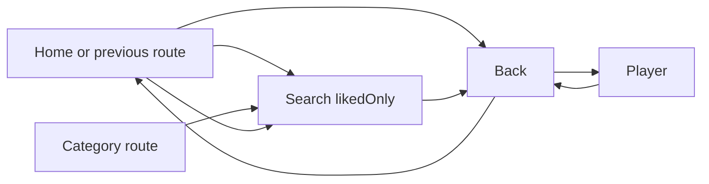

# Điều Hướng và Flow

## 1. Routes

- `/` -> `HomeView`
- `/search` -> `SearchView`
- `/category/:slug` -> `CategoryView` -> reuse `SearchView`
- `/detail/:slug` -> `DetailView`
- `/play/:movieId/:episodeId` -> `PlayerView`

## 2. Route Parameters

- Search:
  - `q`
  - `slug`
  - `likedOnly`
  - `favorite`
  - `mode=favorite`
- Detail:
  - `slug`
- Player:
  - `movieId`
  - `episodeId`
  - arguments map: `movieTitle`, `episodeLabel`

## 3. Flow Summary

## 4. Navigation Notes

- Home hero actions:
  - `Favorite` opens search với `likedOnly=true`
  - `Tìm kiếm` opens global search
  - `Xem ngay` opens detail của movie đang chọn
- Category entry không có màn riêng, mà mở search với preset category.
- Detail screen có nút `Chi tiết` để nhảy sang tab Information nếu tab đó tồn tại.
- Player giữ source selection trong màn và cho phép đổi source ngay trong playback chrome.

